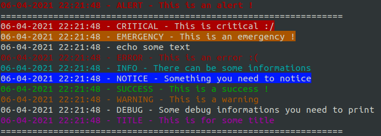

# Simple and light PHP console logger

[](https://app.codacy.com/gh/DamienVauchel/console-logger?utm_source=github.com&utm_medium=referral&utm_content=DamienVauchel/console-logger&utm_campaign=Badge_Grade_Settings)

This library permits you to easily log messages in console for PHP scripts and apps.

## Prerequisites

* PHP >= 7.3

## Install

You can install the package with git clone and composer install in the directory.

Or you can directly use composer :

```bash
composer require scoobydam/console-logger
```

## Use

This library is an easy-to-use and light one. 

```php
use ScoobyConsoleLogger\ConsoleLogger;

$consoleLogger = new ConsoleLogger();

$consoleLogger->alert('This is an alert !')
    ->divider()
    ->critical('This is critical :/')
    ->emergency('This is an emergency !')
    ->echo('echo some text')
    ->error('This is an error :(')
    ->info('There can be some informations')
    ->notice('Something you need to notice')
    ->success('This is a success !')
    ->warning('This is a warning')
    ->debug('Some debug informations you need to print')
    ->title('This is for some title')
;

$consoleLogger->divider();
```



You can chain the functions like in the example above or you can just call your logger in different line.

## Full documentation

To know all what you can do, you can find full documentation [here](./doc/doc.md).

## Contributions

You can send PRs if you want to :)

Just, please, follow these [conventions](./doc/conventions.md).
