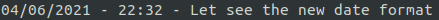
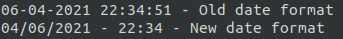
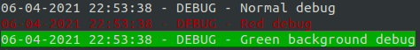
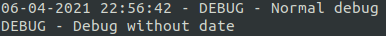
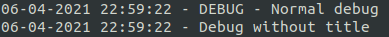
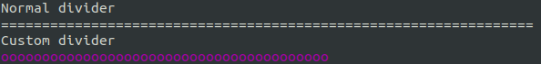

# DvConsoleLogger documentation

To use the library, you have to create an instance of DvConsoleLogger\ConsoleLogger .

Then, you'll be able to run some functions to echo some messages :

```php
use DvConsoleLogger\ConsoleLogger;

$consoleLogger = new ConsoleLogger();

$consoleLogger->alert('This is an alert !')
    ->divider()
    ->critical('This is critical :/')
    ->emergency('This is an emergency !')
    ->echo('echo some text')
    ->error('This is an error :(')
    ->info('There can be some informations')
    ->notice('Something you need to notice')
    ->success('This is a success !')
    ->warning('This is a warning')
    ->debug('Some debug informations you need to print')
    ->title('This is for some title')
;

$consoleLogger->divider();
```


You can chain the functions like in the example above or you can just call your logger in different line.

## Custom date format

You can use your own date format to be displayed. For further informations about date format, please refer to [DateTime documentation](https://www.php.net/manual/en/datetime.format.php).

Default one is  **d-m-Y H:i:s**

2 methods : 

1. Use the constructor

```php
use DvConsoleLogger\ConsoleLogger;

$consoleLogger = new ConsoleLogger('m/d/Y - H:i');

$consoleLogger->echo('Let see the new date format');
```



2. Use the setter

It's usefull if you need to change the date format for some reason.

```php
use DvConsoleLogger\ConsoleLogger;

$consoleLogger = new ConsoleLogger();

$consoleLogger->echo('Old date format');
$consoleLogger->setDateFormat('m/d/Y - H:i');
$consoleLogger->echo('New date format');
```



## Display customization

Each function uses the log() function to display informations. 
This function is PSR-3 convenient :

```php
/**
 * @param mixed $level
 * @param string $message
 */
public function log($level, $message, array $context = []): self
```

All other functions are like :

```php
use DvConsoleLogger\LogLevel;

/** @param string $message */
public function alert($message, array $context = []): self
{
    $this->log(LogLevel::ALERT, $message, $context);

    return $this;
}
```

So you can directly use the log function with custom log levels or directly use functions with some context to customize your display as following.

### Customize color

Some colors are chosen by default with the log level by the log() function. But you can override this color by passing one in the context.

Please use a DvConsoleLogger\ConsoleColor constant to be sure to display a known color.

```php
use DvConsoleLogger\ConsoleLogger;
use DvConsoleLogger\ConsoleColor;

$consoleLogger = new ConsoleLogger();

$consoleLogger->debug('Normal debug');
$consoleLogger->debug('Red debug', ['color' => ConsoleColor::RED]);
$consoleLogger->debug('Green background debug', ['color' => ConsoleColor::GREEN_BG]);
```



### Show date

You can choose to hide the date from the display by setting the **showDate** context parameter to false.

```php
use DvConsoleLogger\ConsoleLogger;

$consoleLogger = new ConsoleLogger();

$consoleLogger->debug('Normal debug');
$consoleLogger->debug('Debug without date', ['showDate' => false]);
```



### Show title

You can choose to hide the title from the display by setting the **showTitle** context parameter to false.

```php
use DvConsoleLogger\ConsoleLogger;

$consoleLogger = new ConsoleLogger();

$consoleLogger->debug('Normal debug');
$consoleLogger->debug('Debug without title', ['showTitle' => false]);
```



### Custom divider

By default, the divider is 65 equal signs in white color.

You can easily use your own divider by setting parameters to the divider() function.

```php
public function divider(string $char = '=', int $number = 65, string $color = ConsoleColor::RESET): self
```

```php
use DvConsoleLogger\ConsoleLogger;
use DvConsoleLogger\ConsoleColor;

$consoleLogger = new ConsoleLogger();

$consoleLogger->echo('Normal divider', ['showDate' => false])
    ->divider();

$consoleLogger->echo('Custom divider', ['showDate' => false])
    ->divider('_', 30, ConsoleColor::MAGENTA);
```


